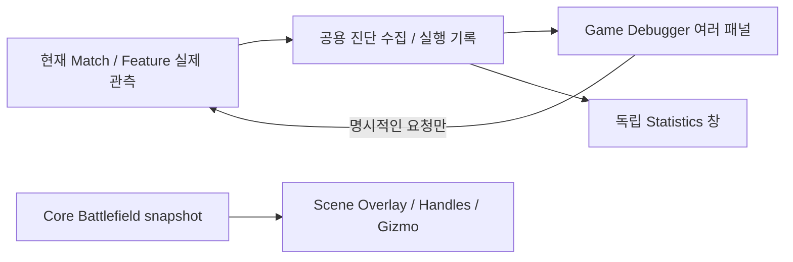

# Game Debugger

> **중요도: 중요** · 도구의 목적과 패널 구성을 먼저 이해하고 싶을 때 읽습니다.

Game Debugger의 목적은 **상태 관측 → 이상 발견 → 사건/요청 선택 → Scene 위치 확인 → 기록 공유**를 한 흐름으로 수행하는 것입니다. 게임 UI의 복제나 별도 게임 시뮬레이터가 아닙니다.

## 패널 지도

| 패널 | 확인하는 것 | 다음 행동 |
| --- | --- | --- |
| Overview | 현재 Match·권한·생존 수·전력·터렛·수집 상태 | 연결 경고 확인, 터렛 객체 선택 |
| Battlefield | Grid 설정, 현재 점유, 영역·외곽 기하 | 셀/변 선택, Scene Frame, ID 복사 |
| Encounter | 일회 요청, 반복 실행, 최근 요청 결과 | 추가 요청, 실패 사유와 수량 확인 |
| Statistics | 시간 그래프 또는 요청 당시 공간 판단 | 시간 구간/Request 선택, 큰 창으로 조회 |
| Timeline | 생성·사망·제거·요청·터렛 사건과 메모 | 조건부 Pause, Bookmark, 상세 조회 |
| Capture / Compare | 실행 기록·메타데이터·A/B 비교 | JSON/CSV Export, 읽기 전용 Import |

## 같은 게임을 여러 각도에서 보는 구조

Scene에는 **현재 기하·점유**, Spawn Inspector에는 **그 요청 당시의 자료**, 그래프에는 **시간 구간별 관측 사실**이 표시됩니다. 같은 화면처럼 보여도 시점이 다르므로 비교할 때 Match·revision·Request를 확인합니다.

## 자주 혼동하는 값

| 표현 | 뜻 | 뜻하지 않는 것 |
| --- | --- | --- |
| LIVE | 현재 실행을 조회 | 모든 네트워크 Client의 동일 상태 보장 |
| PREVIEW | Edit Mode의 정적 터렛 배치 | 실제 Enemy/Player 전투 시뮬레이션 |
| ARCHIVE / IMPORTED | 종료/불러온 실행의 관측 기록 | 과거 게임 상태 복원 |
| PARTIAL | 중간 수집·누락·상한 초과 등의 불완전 기록 | 모든 사건을 담은 완전한 총량 |
| N/A | 관측할 수 없거나 계약이 없는 값 | 관측된 0 |
| EnemyDied | 지원되는 EnemyHealth의 확정 사망 | 모든 Despawn |
| EnemyRemoved | 제거·종료·추적 해제 | 처치 수 |
| Frontline | 현재 Core 영역의 기하 외곽 | 교전 강도·방어 우세·위험도 |

## 안전한 사용 순서

먼저 조회와 일회 요청으로 정상 연결을 확인하고, 그다음 반복·배속·조건부 정지를 사용합니다. Grid 적용·스폰 요청·timeScale 변경은 게임 상태를 바꾸는 명령입니다. Frame·필터·기록 선택·Copy·Export는 조회/탐색 작업입니다.

이 도구는 Unity Profiler의 CPU/GPU 성능 분석이나 Console의 stack trace, 각 Feature의 자동 테스트를 대체하지 않습니다. 현재 제공하지 않는 AI 판단 이유·DPS·실제 전술 우세를 화면에서 추정해 단정하지 않습니다.

## 다음에 읽을 문서

[빠른 시작](quick-start.md) → [창 구성과 시간 제어](window-and-time.md) → 필요한 패널의 문서로 이동하세요.
