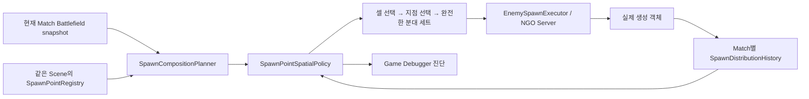

# 공간 기반 스폰 분산

기준: 게임 main `eb35ceb1` · 원본: `Docs/architecture/spatial-spawn-distribution.md`.

스폰 분산은 스포너 개수가 아니라 적합한 Grid 셀의 공간 분포를 기준으로 합니다. 같은 셀에 Spawn Point가 여러 개 있어도 그 셀이 배수의 생성 비중을 얻지 않습니다.

## 배정 규칙

1. 생성 불가, Grid 밖, Player/Turret 점유 셀과 중복·누락 ID를 제외합니다.
2. 적합 후보를 Grid cell ID로 묶고 같은 셀의 현재 Enemy 수와 이번 요청 예정량을 공유합니다.
3. 셀 내부에서는 `point service + 예정량`이 가장 작은 지점을 고릅니다. 동률이면 전선 거리와 안정적인 ID를 사용합니다.
4. 셀은 `cell service + 현재 Enemy 수 + 예정량`이 작은 순서로 비교합니다.
5. 선택한 셀에 프리셋 한 세트를 배정합니다. 전체 예산을 넘기거나 프리셋을 부분 분해하지 않습니다.
6. 실행 뒤 실제 생성 객체 수만 service에 더합니다. 실패 계획은 소비하지 않고 부분 성공은 성공 수만 반영합니다.

`service`는 생성 기회를 분산하는 가상 부하입니다. 처치 수, 생존 수 또는 난이도 점수가 아닙니다. 적이 이동하거나 죽어도 이미 사용한 생성 기회가 초기화되지 않습니다.

다른 Match ID 또는 XY Grid 설정이 바뀌면 이력을 초기화합니다. 표시용 Z, revision, 전선 모양만 바뀐 경우에는 이력을 유지합니다.

## Game Debugger에서 확인

Statistics의 **Spawn decisions / distribution**에서 요청 당시 셀의 적 수, Cell service, Cell pending, Point service, 선택 사유와 실제 생성 결과를 함께 봅니다.

동일 조건 반복 실험에서는 지점별 합계와 함께 셀별 합계를 비교합니다. 한 셀에 지점이 네 개이고 다른 셀에 하나라면 셀 합계는 비슷해질 수 있지만 네 지점은 그 셀의 비중을 나눠 갖습니다.

자세한 화면 사용법은 [Spawn 판단과 분포 검사](../../../editor-tools/the-developer/game-debugger/spawn-inspection.md)를 확인하세요.

