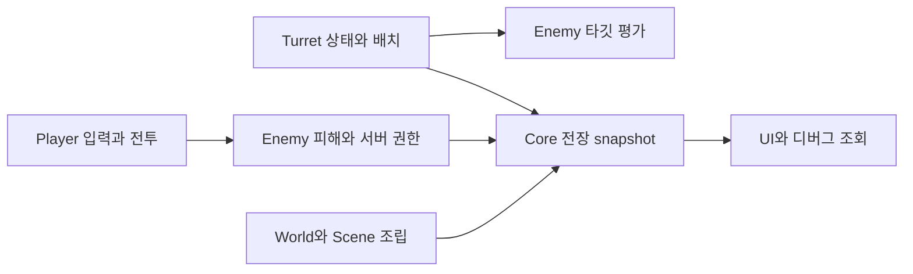

# The Developer 개발 문서

:::info 기준과 공개 범위
2026-10-05 확인한 게임 `main` 커밋 `b73e0e76a93d2b2793751402539e7fb2fe449462` 기준입니다. 원본 문서와 실제 코드를 대조해 정리한 연동 안내이며, Unity 플레이 검증이나 출시 기능의 보증을 뜻하지 않습니다. 게임 코드·원본 에셋·회의록은 복사하지 않습니다. 이 문서 사이트는 공개입니다.
:::

## 필요한 영역부터 읽기

| 영역 | 담당 영역 기준 | 시작 문서 | 다른 영역과의 연결 |
| --- | --- | --- | --- |
| Core / UI | 양현석 | [세션·명령·이벤트](core.md) | 모든 모듈의 수명과 공간 입력 |
| Player | 이영빈 | [입력·전투·피해](player.md) | EnemyHealth, Core 입력 경계 |
| World / Spaceship | 김진태 | [공간·씬 왕복·진행 상태](world.md) | 터렛 배치, Player, 저장 실험 |
| Turret / Power | 황재동 | [터렛 빠른 시작](turret/quick-start.md) | Enemy 타깃, Core 공간, 전력 |
| Enemy / Encounter | 조수빈 | [스폰·타깃·피해](enemy.md) | Player·Turret 타깃, 서버 권한 |

담당 구분은 게임의 `Docs/team/TEAM_ROLE_OWNERSHIP.md`를 참고했습니다. 장기 책임 영역을 현재 구현 완료 상태로 해석하지 마세요.

## 현재 구현과 계획을 구분하기

- **main 구현 확인:** Core 세션 수명·공간 snapshot, Player V2 입력과 탄환, 터렛 registry/snapshot/명령, 적 분대 스폰·서버 피해, Spaceship 씬/JSON 실험.
- **전환 중:** Player/Spaceship의 기존 Manager 접근과 새 Core 계약이 함께 있습니다. 서로 자동 연결됐다고 가정하지 않습니다.
- **미완료·미확정:** Core 명령의 실제 전투 처리, 최종 승패·보상 정책, 완성된 협동 플레이, 영구 저장 계약, Laser의 새 터렛 구조 이식.
- **미병합 기능:** 검토 중인 브랜치의 추가 API를 main 사용법에 섞지 않습니다. `TurretController`·`ControllerSnapshot` 같은 추가 계약을 이 문서의 전제로 요구하지 않습니다.

## 연결 흐름

처음 연동할 때는 [통합 체크리스트](integration.md)를 사용하세요. 타입 이름을 알고 있다면 [API 찾기](api-search.mdx)를 이용하세요. 각 모듈 목차에서 준비·API·실행 흐름·검증 등 필요한 하위 문서를 선택할 수 있습니다.

## 문서 업데이트

Game Debugger와 Scene 표시·반복 실험의 조작법은 [에디터 도구 — The Developer](../../editor-tools/the-developer/index.md)에서 확인합니다. 도구 문서의 확인 버전은 이 API 문서의 main 기준과 별도로 표시합니다.

게임의 main 변경은 이 사이트를 자동 수정하지 않습니다. API가 바뀌면 해당 프로젝트 문서와 확인한 기준 커밋을 `team-hjd-docs`에서 함께 갱신합니다. [문서 기여 가이드](../../team/document-contribution.md)를 따르세요.
